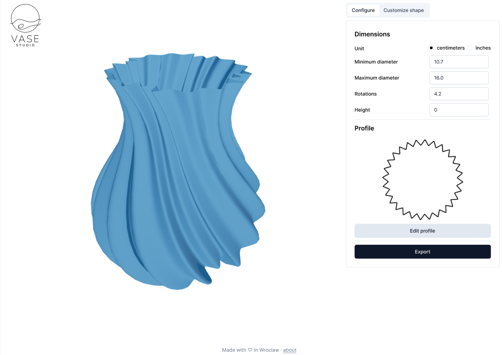

# Vase Studio

We are building easy to use, yet powerful, 3d vase editor.

Models generated by this editor can be 3d printed as spiral vase.

Project is work in progress, concept:

.

# Technology

This is a [Next.js](https://nextjs.org/) project with:

- [Tailwind CSS](https://tailwindcss.com/) for styling
- [shadcn/ui](https://ui.shadcn.com/) for bootstraping UI components
- [Three.js](https://threejs.org/) for 3d rendering
